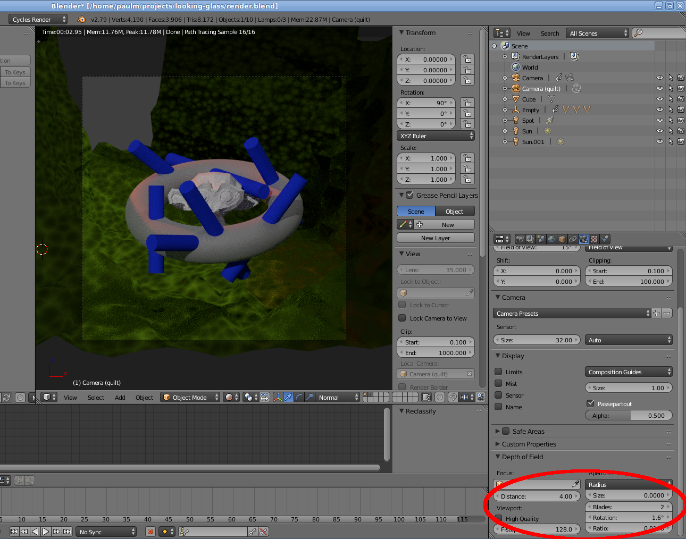
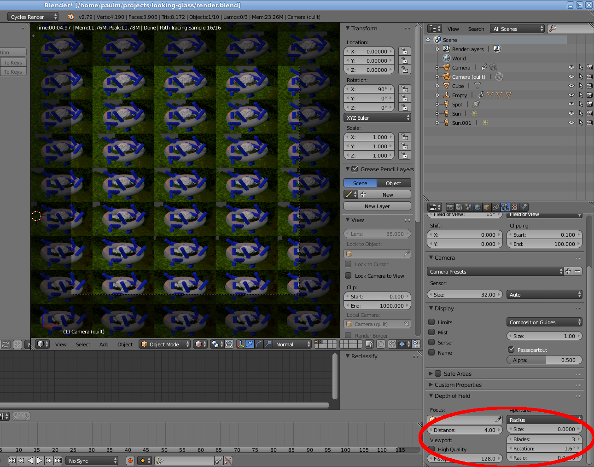

# Blender Looking Glass quilt camera

A patch for Blender 2.79b to hack the perspective camera so it supports rendering a Looking Glass 5x9 quilt directly. I.e. in one pass, without having to render separate views and combine them.

This code replaces the regular blender Perspective camera rendering when the number of DOF Blades (under the Camera settings) is set to 3 or higher. So when blades <=2 you can still check how a single view looks (even though it won't match completely, due to the different aspect ratio of the full quilt versus a single view).

See these screenshots:

When the quilt rendering is active a number of camera settings is misused to pass values to the patched code (again see screenshots above):

- The distance over which the camera is X-shifted over the range  of views is taken from the DOF Distance value. E.g. a value of 4 means the camera has an X shift of -2 for the left-most view and +2 for the right-most view.

- The ratio of the Looking Glass being targeted needs to be set under Aperture, value Rotation. For the standard LG it should be 2560/1600=1.6, for the large model 3840/2160=1.7778

- The field-of-view of the quilt camera is taken from the Field of View setting of the *Panoramic* camera type (which is a different value from the FOV setting in the Perspective type). So switch the camera type to Panoramic and change the Field of View value, then switch the type back to Perspective.

The above effectively disables actually using DOF in the rendering, even though that might be useful for generating visuals for the Looking Glass. However, there's not many other values set from the UI that are readable at the point in the Cycles code where this hooks into.

The performance hit isn't too bad:

| Type | Time |
| ---- | ---- |
| Regular perspective render (center view), 4096x4096, 32 samples per pixel | 4:21.09 |
| Quilt 4096x4096, 45 views, 32 samples per pixel | 5:20.98 (i.e. +23%) |

This is more of a proof-of-concept than anything else:

- The number of tiles is hardcoded to 5x9
- Depth of field doesn't work
- Live cycles preview rendering of the quilt isn't really useful,
  as you can't zoom in the viewport
- Lots of stuff should be precomputed once, instead of for every ray, but the performance hit shouldn't be too bad as we assume the number of primary rays shot here is easily dominated by all the secondary rays generated for surface shading, etc.
- Supports CPU rendering only
- Supports Cycles rendering only
- The ray differentials are probably not correct, which might influence shading

## Patch

Note that this patch applies to the [source tarball](http://download.blender.org/source/blender-2.79b.tar.gz)
of 2.79b, so not the latest git version of the 2.7 branch.
You will need to build Blender from source yourself if you want to use this patch. Tested on Linux when building with GCC 8.2.1 (you might need to apply `gcc8.patch` as well).

Paul Melis, SURFsara (paul.melis@surfsara.nl)
